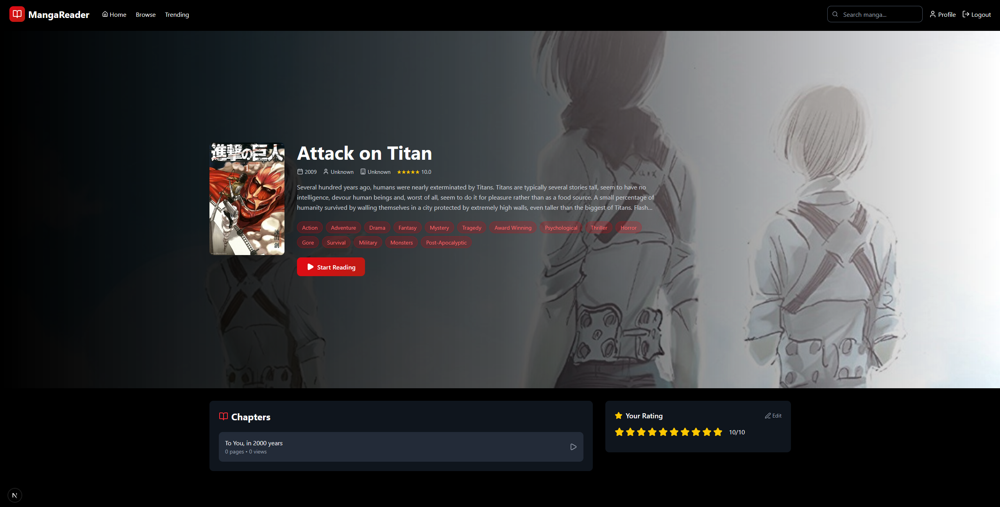
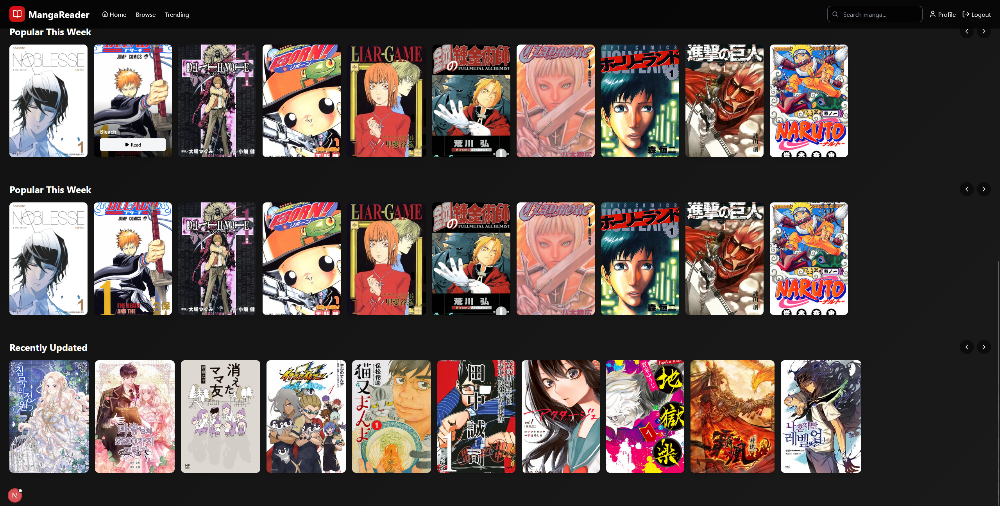
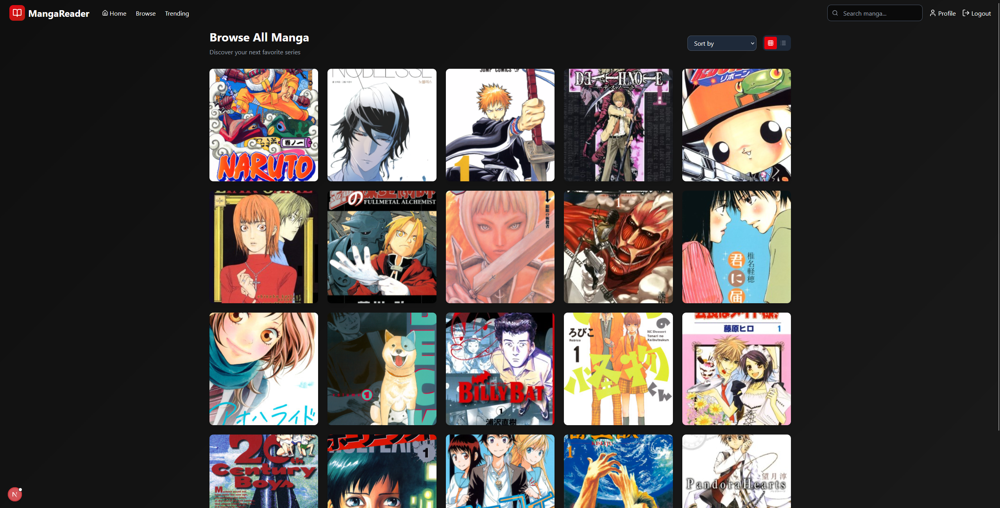
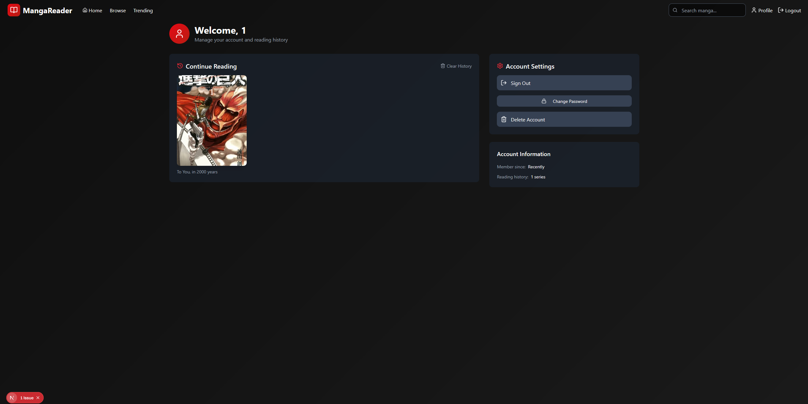
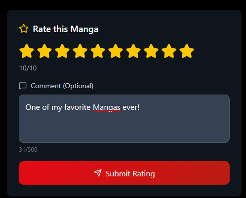

# Manga Reader

The Manga Reader is a full-stack web application that allows users to browse, read, and track their favorite manga. It features a modern, user-friendly interface and a robust backend to manage a vast library of manga series.

## Screenshots

Here's a glimpse of what the Manga Reader application looks like:

| Homepage-Hero | Manga Details |
| :---: | :---: |
|  |  |

| Homepag
| :---: |
|  |


| Browse Page | User Profile |
| :---: | :---: |
|  |  |

| Rating System |
| :---: |
|  |

## Features

- **User Authentication:** Secure user registration and login system.
- **Browse and Search:** Easily discover new manga series through a comprehensive browse and search functionality.
- **Manga Details:** View detailed information about each manga series, including genre, status, and chapters.
- **Chapter Reader:** A reader interface for a reading experience without interruption.
- **Reading History:** Keep track of the chapters you have read and keep going where you left off.
- **Rating System:** Rate your favorite manga series and see average ratings from the community.
- **Trending Section:** Discover what Mangas are currently popular.

## Technology Stack

The project is built with a modern technology stack, containerized for easy setup and deployment.

| Component | Technology |
| :--- | :--- |
| **Backend** | [ASP.NET Core](https://dotnet.microsoft.com/apps/aspnet), [C#](https://learn.microsoft.com/en-us/dotnet/csharp/) |
| **Frontend** | [Next.js](https://nextjs.org/), [React](https://react.dev/), [TypeScript](https://www.typescriptlang.org/), [Tailwind CSS](https://tailwindcss.com/) |
| **Database** | [PostgreSQL](https://www.postgresql.org/) |
| **Containerization** | [Docker](https://www.docker.com/) |

## Getting Started
To get the application up and running locally you can simply use the provided Dockerfiles.
If you wish to run the application without docker you will need npm and .net 9.0+ and PostgreSQL.

```bash
git clone https://github.com/MandoV0/manga-reader.git
cd manga-reader
```

To start the frontend:
```bash
cd mangareader-frontend
npm install
npm run dev
```

To start the backend, you will first need to create a Migration.
```bash
cd MangaReaderAPI
dotnet ef add InitialCreate
dotnet ef database update
```
Also create a .env file
```
SENDGRID_API_KEY=YOUR_API_KEY
SENDGRID_SENDER_EMAIL=YOUR_SENDER_EMAIL
```
And configure the appsetings.json with your PostgreSQL Data.
After that simply type
```bash
dotnet run
```

## Docker
Run this command to build and start the Docker images/containers for the frontend, backend and the database.
```bash
docker-compose up --build
```